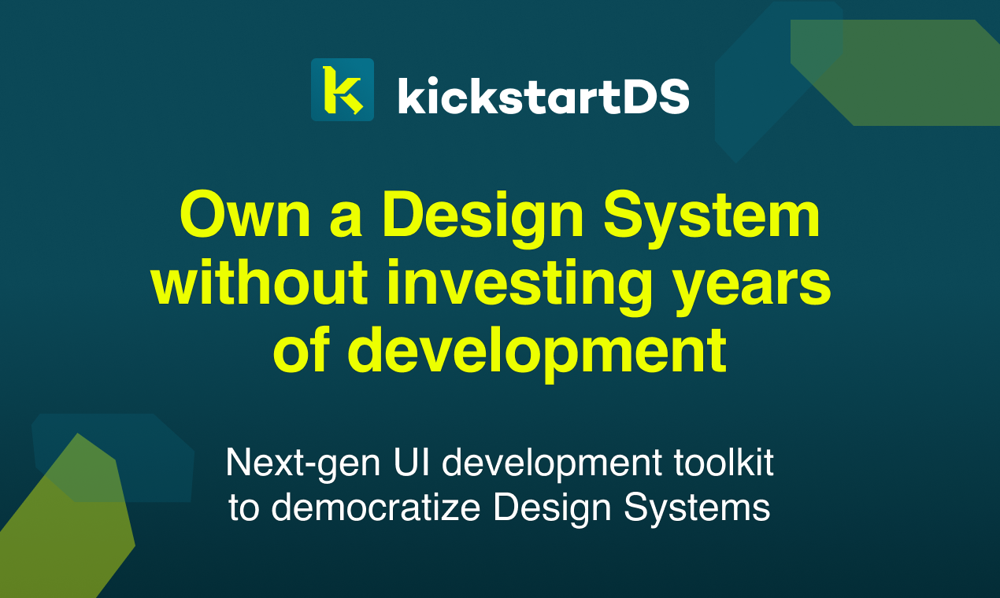
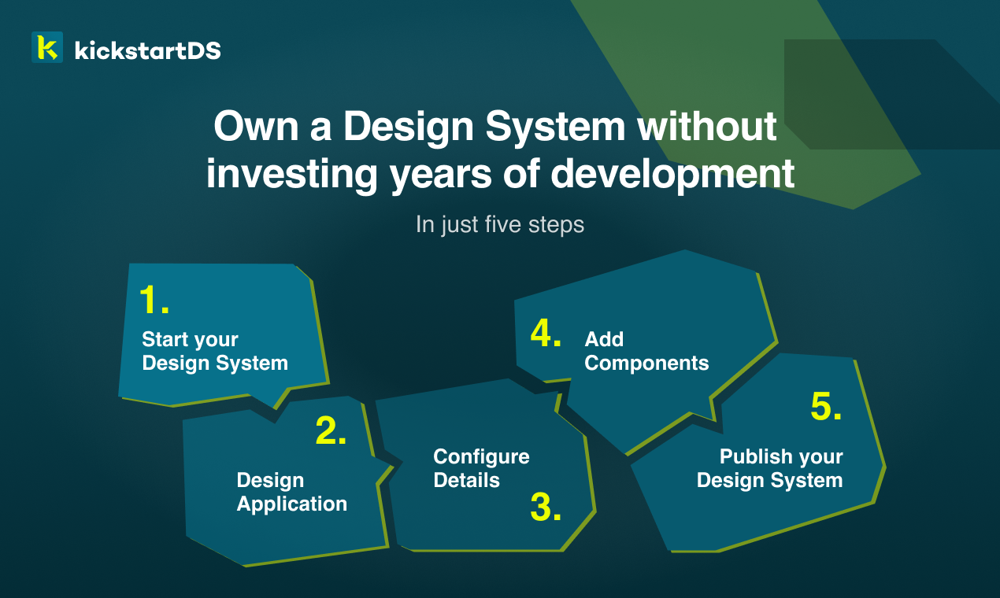

# kickstartDS

kickstartDS is an Open Source Design System starter and UI toolkit for building up your very own Design System. This in turn enables you, and your team, to build brand-compliant websites and apps super efficiently. All while using core web technologies — HTML, CSS, and JavaScript — and best practices.

## Goals

- Great components as the baseline
- Enable flexible + easy design application
- First-class React templating support
- Work with "classic" backend environments, too
- Jamstack & composable integrations

## Documentation

We started work on extensive documentation around **kickstartDS**, the best practices employed, ways of creating components and integrations available. We will continuously expand on this, so please let us know what you're missing!

### Categories

We have the following categories in our docs:

- [**Getting Started**](https://www.kickstartds.com/docs/intro/): intro to **kickstartDS**, its requirements and basic usage
- [**Foundations**](https://www.kickstartds.com/docs/foundations/): explanations for all basic building blocks like token, components and layout
- [**Integration**](https://www.kickstartds.com/docs/integration/): available integrations that can take work off your shoulders
- [**Guides**](https://www.kickstartds.com/docs/guides/): main Design System setup guide, and guides around specific component workflows
- **Concepts** (coming soon): Background articles about the concepts involved, like **Semantic Token**, **JSON Schema**, and the likes

### Create your Design System guide

This is our main guide, where you'll create a complete Design System from scratch... based on **kickstartDS**.

Start here: https://www.kickstartds.com/docs/guides/create/

Or jump directly into a specific section of it:

1. [Start your Design System](https://www.kickstartds.com/docs/guides/create/start)
2. [Design Application](https://www.kickstartds.com/docs/guides/create/design)
3. [Configure Storybook](https://www.kickstartds.com/docs/guides/create/storybook)
4. [Add Components](https://www.kickstartds.com/docs/guides/create/components)
5. [Publish your Design System](https://www.kickstartds.com/docs/guides/create/publish)

## kickstartDS CLI

We have a dedicated CLI, you can find it over here: 
https://github.com/kickstartDS/kickstartDS-cli

Our CLI helps deliver everyday tasks faster, and with less errors! Create and compile token, work with **JSON Schema** and other parts of **kickstartDS**.

Learn more about our CLI in our docs: 
https://www.kickstartds.com/docs/intro/cli

## Tooling

No modern technical solutions exists in a vacuum. Having a lively ecosystem enables broader and quicker adoption, while sharing knowledge and common learnings with a wider, organic community.

This is why we're also always actively trying to add building blocks to that ecosystem ourselves, while listening closely to which problems people are actually trying to solve.

We already have the following in place:

- Generator (to convert your component **JSON Schema** into a variety of different formats, including component **TypeScript** types)
- **Gatsby** Theme (to enable low-code integration of your Design System into your website)
- **Next.js** helper (to smooth out development of **Next.js** based apps and interfaces with **kickstartDS**)
- **GraphQL** tooling (to generate **GraphQL** types, fragments, amongst others matching your components and their documentation)

Learn more about generators on our integration page: 
https://www.kickstartds.com/integrations/

Or read our documentation about tooling and integrations: 
https://www.kickstartds.com/docs/integration/

## Community

We try to have a healthy, friendly and active community. Although it's still quite small, this also enables us to respond to requests in a very hands-on fashion.

Feel free to [join us on Discord](https://discord.gg/mwKzD5gejY)!

If that's not your cup of tea, you can also reach out to us:

- by [writing us an email](mailto:hello@kickstartds.com)
- by [joining us on Twitter](https://twitter.com/intent/follow?screen_name=kickstartDS)
- by [writing us on WhatsApp](https://wa.me/491752131879?text=Hi!%20I%20am%20interested%20to%20know%20more%20about%20kickstartDS.)

## Development

This project is managed by [lerna](https://lernajs.io/). Each module is an independent lerna package. Install module-specific dependencies only via `lerna add` (see "Install npm dependencies" section)!

### Requirements

#### Environment

- [node](https://nodejs.org/en/) >= v14 – if you have [nvm](https://github.com/creationix/nvm#node-version-manager---) installed, you can just run `nvm use` to select the right node version.

- [yarn](https://classic.yarnpkg.com/lang/en/) classic

#### Global npm packages

- [commitizen](http://commitizen.github.io/cz-cli/) – Constistent commit messages. Read more about the commit conventions in the "Commit changes"-section.

`npm install -g lerna commitizen`

If you cannot or don't want to install global packages, you can use yarn. E.g. instead of `git cz`, you can also call `yarn git-cz`.

### Locally

#### Installation

- `yarn` - installs npm dependencies for all frontend modules

#### Scripts

- `yarn build` – builds the pattern library
- `yarn storybook start` - starts a storybook with all components
- `yarn lint` – checks sass- & js-files against potential errors
- `yarn list` – lists all lerna packages

### Release

Releases are mangaged by [Auto](https://intuit.github.io/auto/index).

### Module Development

All modules are placed in the _pacakges/components_ directory. They are individual npm packages mangaged by [yarn workspaces](https://classic.yarnpkg.com/en/docs/workspaces).

#### Install npm dependencies

Don't install module dependencies manually, let yarn do the job!
E.g. to install "package-xy" in module "news", run `yarn workspace news add package-xy` in the projects root directory.

### Commit changes

This project uses [commitizen](http://commitizen.github.io/cz-cli/). So in order to commit your changes, run `git cz` (or `yarn git-cz` if commitizen is not installed globally) instead of `git commit`. commitizen will then ask you a few questions about the change:

- **type** – The type of the change (e.g. feature, fix, refactoring)
- **scope** - The name of the module affected (e.g. base, products, news)
- **ticket number** – The JIRA ticket id
- **subject** - Contains a succinct description of the change
  - use the imperative, present tense: "change" not "changed" nor "changes"
  - don't capitalize the first letter
  - no dot (.) at the end
- **body** - Just as in the subject, use the imperative, present tense. The body should include the motivation for the change and contrast this with previous behavior
- **breaking changes** – Description of the change, justification and migration notes

This convention is based loosely on the [angular commit message guidlines](https://github.com/angular/angular/blob/master/CONTRIBUTING.md#-commit-message-guidelines) and ensures constistent commit messages, so they can be automatically converted into a changelog.

## Contributing

Unless you explicitly state otherwise, any contribution intentionally submitted
for inclusion in the work by you, as defined in the Apache-2.0 license, shall be
dual licensed as below, without any additional terms or conditions.

## License

&copy; Copyright 2022 Jonas Ulrich, kickstartDS by ruhmesmeile GmbH [jonas.ulrich@kickstartds.com].

This project is licensed under either of

- [Apache License, Version 2.0](https://www.apache.org/licenses/LICENSE-2.0) ([`LICENSE-APACHE`](LICENSE-APACHE))
- [MIT license](https://opensource.org/licenses/MIT) ([`LICENSE-MIT`](LICENSE-MIT))

at your option.

The [SPDX](https://spdx.dev) license identifier for this project is `MIT OR Apache-2.0`.
